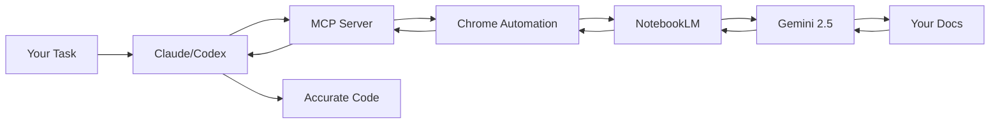

<div align="center">

# NotebookLM MCP Server

**Let your CLI agents (Claude, Cursor, Codex...) chat directly with NotebookLM for zero-hallucination answers based on your own notebooks**

[](https://www.typescriptlang.org/)
[](https://modelcontextprotocol.io/)
[](https://www.npmjs.com/package/notebooklm-mcp)
[](https://github.com/PleasePrompto/notebooklm-skill)
[](https://github.com/PleasePrompto/notebooklm-mcp)

[Installation](#installation) • [Quick Start](#quick-start) • [Why NotebookLM](#why-notebooklm-not-local-rag) • [Examples](#real-world-example) • [Claude Code Skill](https://github.com/PleasePrompto/notebooklm-skill) • [Documentation](./docs/)

</div>

---

## The Problem

When you tell Claude Code or Cursor to "search through my local documentation", here's what happens:
- **Massive token consumption**: Searching through documentation means reading multiple files repeatedly
- **Inaccurate retrieval**: Searches for keywords, misses context and connections between docs
- **Hallucinations**: When it can't find something, it invents plausible-sounding APIs
- **Expensive & slow**: Each question requires re-reading multiple files

## The Solution

Let your local agents chat directly with [**NotebookLM**](https://notebooklm.google/) — Google's **zero-hallucination knowledge base** powered by Gemini 2.5 that provides intelligent, synthesized answers from your docs.

```
Your Task → Local Agent asks NotebookLM → Gemini synthesizes answer → Agent writes correct code
```

**The real advantage**: No more manual copy-paste between NotebookLM and your editor. Your agent asks NotebookLM directly and gets answers straight back in the CLI. It builds deep understanding through automatic follow-ups — Claude asks multiple questions in sequence, each building on the last, getting specific implementation details, edge cases, and best practices. You can save NotebookLM links to your local library with tags and descriptions, and Claude automatically selects the relevant notebook based on your current task.

---

## Why NotebookLM, Not Local RAG?

| Approach | Token Cost | Setup Time | Hallucinations | Answer Quality |
|----------|------------|------------|----------------|----------------|
| **Feed docs to Claude** | 🔴 Very high (multiple file reads) | Instant | Yes - fills gaps | Variable retrieval |
| **Web search** | 🟡 Medium | Instant | High - unreliable sources | Hit or miss |
| **Local RAG** | 🟡 Medium-High | Hours (embeddings, chunking) | Medium - retrieval gaps | Depends on setup |
| **NotebookLM MCP** | 🟢 Minimal | 5 minutes | **Zero** - refuses if unknown | Expert synthesis |

### What Makes NotebookLM Superior?

1. **Pre-processed by Gemini**: Upload docs once, get instant expert knowledge
2. **Natural language Q&A**: Not just retrieval — actual understanding and synthesis
3. **Multi-source correlation**: Connects information across 50+ documents
4. **Citation-backed**: Every answer includes source references
5. **No infrastructure**: No vector DBs, embeddings, or chunking strategies needed

---

## Installation

### Claude Code
```bash
claude mcp add notebooklm npx notebooklm-mcp@latest
```

### Codex
```bash
codex mcp add notebooklm -- npx notebooklm-mcp@latest
```

<details>
<summary>Gemini</summary>

```bash
gemini mcp add notebooklm npx notebooklm-mcp@latest
```
</details>

<details>
<summary>Cursor</summary>

Add to `~/.cursor/mcp.json`:
```json
{
  "mcpServers": {
    "notebooklm": {
      "command": "npx",
      "args": ["-y", "notebooklm-mcp@latest"]
    }
  }
}
```
</details>

<details>
<summary>amp</summary>

```bash
amp mcp add notebooklm -- npx notebooklm-mcp@latest
```
</details>

<details>
<summary>VS Code</summary>

```bash
code --add-mcp '{"name":"notebooklm","command":"npx","args":["notebooklm-mcp@latest"]}'
```
</details>

<details>
<summary>Other MCP clients</summary>

**Generic MCP config:**
```json
{
  "mcpServers": {
    "notebooklm": {
      "command": "npx",
      "args": ["notebooklm-mcp@latest"]
    }
  }
}
```
</details>

---

## Alternative: Claude Code Skill

**Prefer Claude Code Skills over MCP?** This server is now also available as a native Claude Code Skill with a simpler setup:

**[NotebookLM Claude Code Skill](https://github.com/PleasePrompto/notebooklm-skill)** - Clone to `~/.claude/skills` and start using immediately

**Key differences:**
- **MCP Server** (this repo): Persistent sessions, works with Claude Code, Codex, Cursor, and other MCP clients
- **Claude Code Skill**: Simpler setup, Python-based, stateless queries, works only with local Claude Code

Both use the same browser automation technology and provide zero-hallucination answers from your NotebookLM notebooks.

---

## Quick Start

### 1. Install the MCP server (see [Installation](#installation) above)

### 2. Authenticate (one-time)

Say in your chat (Claude/Codex):
```
"Log me in to NotebookLM"
```
*A Chrome window opens → log in with Google*

### 3. Create your knowledge base
Go to [notebooklm.google.com](https://notebooklm.google.com) → Create notebook → Upload your docs:
- 📄 PDFs, Google Docs, markdown files
- 🔗 Websites, GitHub repos
- 🎥 YouTube videos
- 📚 Multiple sources per notebook

Share: **⚙️ Share → Anyone with link → Copy**

### 4. Let Claude use it
```
"I'm building with [library]. Here's my NotebookLM: [link]"
```

**That's it.** Claude now asks NotebookLM whatever it needs, building expertise before writing code.

---

## Real-World Example

### Building an n8n Workflow Without Hallucinations

**Challenge**: n8n's API is new — Claude hallucinates node names and functions.

**Solution**:
1. Downloaded complete n8n documentation → merged into manageable chunks
2. Uploaded to NotebookLM
3. Told Claude: *"Build me a Gmail spam filter workflow. Use this NotebookLM: [link]"*

**Watch the AI-to-AI conversation:**

```
Claude → "How does Gmail integration work in n8n?"
NotebookLM → "Use Gmail Trigger with polling, or Gmail node with Get Many..."

Claude → "How to decode base64 email body?"
NotebookLM → "Body is base64url encoded in payload.parts, use Function node..."

Claude → "How to parse OpenAI response as JSON?"
NotebookLM → "Set responseFormat to json, use {{ $json.spam }} in IF node..."

Claude → "What about error handling if the API fails?"
NotebookLM → "Use Error Trigger node with Continue On Fail enabled..."

Claude → ✅ "Here's your complete workflow JSON..."
```

**Result**: Perfect workflow on first try. No debugging hallucinated APIs.

---

## Core Features

### **Zero Hallucinations**
NotebookLM refuses to answer if information isn't in your docs. No invented APIs.

### **Autonomous Research**
Claude asks follow-up questions automatically, building complete understanding before coding.

### **Smart Library Management**
Save NotebookLM links with tags and descriptions. Claude auto-selects the right notebook for your task.
```
"Add [link] to library tagged 'frontend, react, components'"
```

### **Deep, Iterative Research**
- Claude automatically asks follow-up questions to build complete understanding
- Each answer triggers deeper questions until Claude has all the details
- Example: For n8n workflow, Claude asked multiple sequential questions about Gmail integration, error handling, and data transformation

### **Cross-Tool Sharing**
Set up once, use everywhere. Claude Code, Codex, Cursor — all share the same library.

### **Deep Cleanup Tool**
Fresh start anytime. Scans entire system for NotebookLM data with categorized preview.

---

## Tool Profiles

Reduce token usage by loading only the tools you need. Each tool consumes context tokens — fewer tools = faster responses and lower costs.

### Available Profiles

| Profile | Tools | Use Case |
|---------|-------|----------|
| **minimal** | 5 | Query-only: `ask_question`, `get_health`, `list_notebooks`, `select_notebook`, `get_notebook` |
| **standard** | 10 | + Library management: `setup_auth`, `list_sessions`, `add_notebook`, `update_notebook`, `search_notebooks` |
| **full** | 16 | All tools including `cleanup_data`, `re_auth`, `remove_notebook`, `reset_session`, `close_session`, `get_library_stats` |

### Configure via CLI

```bash
# Check current settings
npx notebooklm-mcp config get

# Set a profile
npx notebooklm-mcp config set profile minimal
npx notebooklm-mcp config set profile standard
npx notebooklm-mcp config set profile full

# Disable specific tools (comma-separated)
npx notebooklm-mcp config set disabled-tools "cleanup_data,re_auth"

# Reset to defaults
npx notebooklm-mcp config reset
```

### Configure via Environment Variables

```bash
# Set profile
export NOTEBOOKLM_PROFILE=minimal

# Disable specific tools
export NOTEBOOKLM_DISABLED_TOOLS="cleanup_data,re_auth,remove_notebook"
```

Settings are saved to `~/.config/notebooklm-mcp/settings.json` and persist across sessions. Environment variables override file settings.

---

## Architecture



---

## Common Commands

| Intent | Say | Result |
|--------|-----|--------|
| Authenticate | *"Open NotebookLM auth setup"* or *"Log me in to NotebookLM"* | Chrome opens for login |
| Add notebook | *"Add [link] to library"* | Saves notebook with metadata |
| List notebooks | *"Show our notebooks"* | Lists all saved notebooks |
| Research first | *"Research this in NotebookLM before coding"* | Multi-question session |
| Select notebook | *"Use the React notebook"* | Sets active notebook |
| Update notebook | *"Update notebook tags"* | Modify metadata |
| Remove notebook | *"Remove [notebook] from library"* | Deletes from library |
| View browser | *"Show me the browser"* | Watch live NotebookLM chat |
| Fix auth | *"Repair NotebookLM authentication"* | Clears and re-authenticates |
| Switch account | *"Re-authenticate with different Google account"* | Changes account |
| Clean restart | *"Run NotebookLM cleanup"* | Removes all data for fresh start |
| Keep library | *"Cleanup but keep my library"* | Preserves notebooks |
| Delete all data | *"Delete all NotebookLM data"* | Complete removal |

---

## Comparison to Alternatives

### vs. Downloading docs locally
- **You**: Download docs → Claude: "search through these files"
- **Problem**: Claude reads thousands of files → massive token usage, often misses connections
- **NotebookLM**: Pre-indexed by Gemini, semantic understanding across all docs

### vs. Web search
- **You**: "Research X online"
- **Problem**: Outdated info, hallucinated examples, unreliable sources
- **NotebookLM**: Only your trusted docs, always current, with citations

### vs. Local RAG setup
- **You**: Set up embeddings, vector DB, chunking strategy, retrieval pipeline
- **Problem**: Hours of setup, tuning retrieval, still gets "creative" with gaps
- **NotebookLM**: Upload docs → done. Google handles everything.

---

## FAQ

**Is it really zero hallucinations?**
Yes. NotebookLM is specifically designed to only answer from uploaded sources. If it doesn't know, it says so.

**What about rate limits?**
Free tier has daily query limits per Google account. Quick account switching supported for continued research.

**How secure is this?**
Chrome runs locally. Your credentials never leave your machine. Use a dedicated Google account if concerned.

**Can I see what's happening?**
Yes! Say *"Show me the browser"* to watch the live NotebookLM conversation.

**What makes this better than Claude's built-in knowledge?**
Your docs are always current. No training cutoff. No hallucinations. Perfect for new libraries, internal APIs, or fast-moving projects.

---

## Advanced Usage

- 📖 [**Usage Guide**](./docs/usage-guide.md) — Patterns, workflows, tips
- 🛠️ [**Tool Reference**](./docs/tools.md) — Complete MCP API
- 🔧 [**Configuration**](./docs/configuration.md) — Environment variables
- 🐛 [**Troubleshooting**](./docs/troubleshooting.md) — Common issues

---

## The Bottom Line

**Without NotebookLM MCP**: Write code → Find it's wrong → Debug hallucinated APIs → Repeat

**With NotebookLM MCP**: Claude researches first → Writes correct code → Ship faster

Stop debugging hallucinations. Start shipping accurate code.

```bash
# Get started in 30 seconds
claude mcp add notebooklm npx notebooklm-mcp@latest
```

---

## Disclaimer

This tool automates browser interactions with NotebookLM to make your workflow more efficient. However, a few friendly reminders:

**About browser automation:**
While I've built in humanization features (realistic typing speeds, natural delays, mouse movements) to make the automation behave more naturally, I can't guarantee Google won't detect or flag automated usage. I recommend using a dedicated Google account for automation rather than your primary account—think of it like web scraping: probably fine, but better safe than sorry!

**About CLI tools and AI agents:**
CLI tools like Claude Code, Codex, and similar AI-powered assistants are incredibly powerful, but they can make mistakes. Please use them with care and awareness:
- Always review changes before committing or deploying
- Test in safe environments first
- Keep backups of important work
- Remember: AI agents are assistants, not infallible oracles

I built this tool for myself because I was tired of the copy-paste dance between NotebookLM and my editor. I'm sharing it in the hope it helps others too, but I can't take responsibility for any issues, data loss, or account problems that might occur. Use at your own discretion and judgment.

That said, if you run into problems or have questions, feel free to open an issue on GitHub. I'm happy to help troubleshoot!

---

## Contributing

Found a bug? Have a feature idea? [Open an issue](https://github.com/PleasePrompto/notebooklm-mcp/issues) or submit a PR!

## License

MIT — Use freely in your projects.

---

<div align="center">

Built with frustration about hallucinated APIs, powered by Google's NotebookLM

⭐ [Star on GitHub](https://github.com/PleasePrompto/notebooklm-mcp) if this saves you debugging time!

</div>


---

# docs/configuration.md

## Configuration

**No config files needed!** The server works out of the box with sensible defaults.

### Configuration Priority (highest to lowest):
1. **Tool Parameters** - Claude passes settings like `browser_options` at runtime
2. **Environment Variables** - Optional overrides for advanced users
3. **Hardcoded Defaults** - Sensible defaults that work for most users

---

## Tool Parameters (Runtime Configuration)

Claude can control browser behavior via the `browser_options` parameter in tools like `ask_question`, `setup_auth`, and `re_auth`:

```typescript
browser_options: {
  show: boolean,              // Show browser window (overrides headless)
  headless: boolean,          // Run in headless mode (default: true)
  timeout_ms: number,         // Browser timeout in ms (default: 30000)

  stealth: {
    enabled: boolean,         // Master switch (default: true)
    random_delays: boolean,   // Random delays between actions (default: true)
    human_typing: boolean,    // Human-like typing (default: true)
    mouse_movements: boolean, // Realistic mouse movements (default: true)
    typing_wpm_min: number,   // Min typing speed (default: 160)
    typing_wpm_max: number,   // Max typing speed (default: 240)
    delay_min_ms: number,     // Min delay between actions (default: 100)
    delay_max_ms: number,     // Max delay between actions (default: 400)
  },

  viewport: {
    width: number,            // Viewport width (default: 1024)
    height: number,           // Viewport height (default: 768)
  }
}
```

**Example usage:**
- "Research this and show me the browser" → Sets `show: true`
- "Use slow typing for this query" → Adjusts typing WPM via stealth settings

---

## Environment Variables (Optional)

For advanced users who want to set global defaults:
- Auth
  - `AUTO_LOGIN_ENABLED` — `true|false` (default `false`)
  - `LOGIN_EMAIL`, `LOGIN_PASSWORD` — for auto‑login if enabled
  - `AUTO_LOGIN_TIMEOUT_MS` (default `120000`)
- Stealth / Human-like behavior
  - `STEALTH_ENABLED` — `true|false` (default `true`) — Master switch for all stealth features
  - `STEALTH_RANDOM_DELAYS` — `true|false` (default `true`)
  - `STEALTH_HUMAN_TYPING` — `true|false` (default `true`)
  - `STEALTH_MOUSE_MOVEMENTS` — `true|false` (default `true`)
- Typing speed (human‑like)
  - `TYPING_WPM_MIN` (default 160), `TYPING_WPM_MAX` (default 240)
- Delays (human‑like)
  - `MIN_DELAY_MS` (default 100), `MAX_DELAY_MS` (default 400)
- Browser
  - `HEADLESS` (default `true`), `BROWSER_TIMEOUT` (ms, default `30000`)
- Sessions
  - `MAX_SESSIONS` (default 10), `SESSION_TIMEOUT` (s, default 900)
- Multi‑instance profile strategy
  - `NOTEBOOK_PROFILE_STRATEGY` — `auto|single|isolated` (default `auto`)
  - `NOTEBOOK_CLONE_PROFILE` — clone base profile into isolated dir (default `false`)
- Cleanup (to prevent disk bloat)
  - `NOTEBOOK_CLEANUP_ON_STARTUP` (default `true`)
  - `NOTEBOOK_CLEANUP_ON_SHUTDOWN` (default `true`)
  - `NOTEBOOK_INSTANCE_TTL_HOURS` (default `72`)
  - `NOTEBOOK_INSTANCE_MAX_COUNT` (default `20`)
- Library metadata (optional hints)
  - `NOTEBOOK_DESCRIPTION`, `NOTEBOOK_TOPICS`, `NOTEBOOK_CONTENT_TYPES`, `NOTEBOOK_USE_CASES`
  - `NOTEBOOK_URL` — optional; leave empty and manage notebooks via the library

---

## Storage Paths

The server uses platform-specific paths via [env-paths](https://github.com/sindresorhus/env-paths)
- **Linux**: `~/.local/share/notebooklm-mcp/`
- **macOS**: `~/Library/Application Support/notebooklm-mcp/`
- **Windows**: `%LOCALAPPDATA%\notebooklm-mcp\`

**What's stored:**
- `chrome_profile/` - Persistent Chrome browser profile with login session
- `browser_state/` - Browser context state and cookies
- `library.json` - Your notebook library with metadata
- `chrome_profile_instances/` - Isolated Chrome profiles for concurrent sessions

**No config.json file** - Configuration is purely via environment variables or tool parameters!


# docs/tools.md

## Tools

### Core
- `ask_question`
  - Parameters: `question` (string, required), optional `session_id`, `notebook_id`, `notebook_url`, `show_browser`.
  - Returns NotebookLM's answer plus the follow-up reminder.
- `list_sessions`, `close_session`, `reset_session`
  - Inspect or manage active browser sessions.
- `get_health`
  - Summaries auth status, active sessions, and configuration.
- `setup_auth`
  - Opens the persistent Chrome profile so you can log in manually.
- `re_auth`
  - Switch to a different Google account or re-authenticate.
  - Use when NotebookLM rate limit is reached (50 queries/day for free accounts).
  - Closes all sessions, clears auth data, and opens browser for fresh login.

### Notebook library
- `add_notebook` – Safe conversational add; expects confirmation before writing.
- `list_notebooks` – Returns id, name, topics, URL, metadata for every entry.
- `get_notebook` – Fetch a single notebook by id.
- `select_notebook` – Set the active default notebook.
- `update_notebook` – Modify metadata fields.
- `remove_notebook` – Removes entries from the library (not the original NotebookLM notebook).
- `search_notebooks` – Simple query across name/description/topics/tags.
- `get_library_stats` – Aggregate statistics (total notebooks, usage counts, etc.).

### Resources
- `notebooklm://library`
  - JSON representation of the full library: active notebook, stats, individual notebooks.
- `notebooklm://library/{id}`
  - Fetch metadata for a specific notebook. The `{id}` completion pulls from the library automatically.

**Remember:** Every `ask_question` response ends with a reminder that nudges your agent to keep asking until the user’s task is fully addressed.


# docs/troubleshooting.md

## Troubleshooting

### Fresh start / Deep cleanup
If you're experiencing persistent issues, corrupted data, or want to start completely fresh:

**⚠️ CRITICAL: Close ALL Chrome/Chromium instances before cleanup!** Open browsers can prevent cleanup and cause issues.

**Recommended workflow:**
1. Close all Chrome/Chromium windows and instances
2. Ask: "Run NotebookLM cleanup and preserve my library"
3. Review the preview - you'll see exactly what will be deleted
4. Confirm deletion
5. Re-authenticate: "Open NotebookLM auth setup"

**What gets cleaned:**
- Browser data, cache, Chrome profiles
- Temporary files and logs
- Old installation data
- **Preserved:** Your notebook library (when using preserve option)

**Useful for:**
- Authentication problems
- Browser session conflicts
- Corrupted browser profiles
- Clean reinstalls
- Switching between accounts

### Browser closed / `newPage` errors
- Symptom: `browserContext.newPage: Target page/context/browser has been closed`.
- Fix: The server auto‑recovers (recreates context and page). Re‑run the tool.

### Profile lock / `ProcessSingleton` errors
- Cause: Another Chrome is using the base profile.
- Fix: `NOTEBOOK_PROFILE_STRATEGY=auto` (default) falls back to isolated per‑instance profiles; or set `isolated`.

### Authentication issues
**Quick fix:** Ask the agent to repair authentication; it will run `get_health` → `setup_auth` → `get_health`.

**For persistent auth failures:**
1. Close ALL Chrome/Chromium instances
2. Ask: "Run NotebookLM cleanup with library preservation"
3. After cleanup completes, ask: "Open NotebookLM auth setup"
4. This creates a completely fresh browser session while keeping your notebooks

**Auto-login (optional):**
- Set `AUTO_LOGIN_ENABLED=true` with `LOGIN_EMAIL`, `LOGIN_PASSWORD` environment variables
- For automation workflows only

### Typing speed too slow/fast
- Adjust `TYPING_WPM_MIN`/`MAX`; or disable stealth typing by setting `STEALTH_ENABLED=false`.

### Rate limit reached
- Symptom: "NotebookLM rate limit reached (50 queries/day for free accounts)".
- Fix: Use `re_auth` tool to switch to a different Google account, or wait until tomorrow.
- Upgrade: Google AI Pro/Ultra gives 5x higher limits.

### No notebooks found
- Ask to add the NotebookLM link you need.
- Ask to list the stored notebooks, then choose the one to activate.


# docs/usage-guide.md

# Advanced Usage Guide

This guide covers advanced usage patterns, best practices, and detailed examples for the NotebookLM MCP server.

> 📘 For installation and quick start, see the main [README](../README.md).

## Research Patterns

### The Iterative Research Pattern

The server is designed to make your agent **ask questions automatically** with NotebookLM. Here's how to leverage this:

1. **Start with broad context**
   ```
   "Before implementing the webhook system, research the complete webhook architecture in NotebookLM, including error handling, retry logic, and security considerations."
   ```

2. **The agent will automatically**:
   - Ask an initial question to NotebookLM
   - Read the reminder at the end of each response
   - Ask follow-up questions to gather more details
   - Continue until it has comprehensive understanding
   - Only then provide you with a complete answer

3. **Session management**
   - The agent maintains the same `session_id` throughout the research
   - This preserves context across multiple questions
   - Sessions auto-cleanup after 15 minutes of inactivity

### Deep Dive Example

```
User: "I need to implement OAuth2 with refresh tokens. Research the complete flow first."

Agent behavior:
1. Asks NotebookLM: "How does OAuth2 refresh token flow work?"
2. Gets answer with reminder to ask more
3. Asks: "What are the security best practices for storing refresh tokens?"
4. Asks: "How to handle token expiration and renewal?"
5. Asks: "What are common implementation pitfalls?"
6. Synthesizes all answers into comprehensive implementation plan
```

## Notebook Management Strategies

### Multi-Project Setup

Organize notebooks by project or domain:

```
Production Docs Notebook → APIs, deployment, monitoring
Development Notebook → Local setup, debugging, testing
Architecture Notebook → System design, patterns, decisions
Legacy Code Notebook → Old systems, migration guides
```

### Notebook Switching Patterns

```
"For this bug fix, use the Legacy Code notebook."
"Switch to the Architecture notebook for this design discussion."
"Use the Production Docs for deployment steps."
```

### Metadata Best Practices

When adding notebooks, provide rich metadata:
```
"Add this notebook with description: 'Complete React 18 documentation including hooks, performance, and migration guides' and tags: react, frontend, hooks, performance"
```

## Authentication Management

### Account Rotation Strategy

Free tier provides 50 queries/day per account. Maximize usage:

1. **Primary account** → Main development work
2. **Secondary account** → Testing and validation
3. **Backup account** → Emergency queries when others are exhausted

```
"Switch to secondary account" → When approaching limit
"Check health status" → Verify which account is active
```

### Handling Auth Failures

The agent can self-repair authentication:

```
"NotebookLM says I'm logged out—repair authentication"
```

This triggers: `get_health` → `setup_auth` → `get_health`

## Advanced Configuration

### Performance Optimization

For faster interactions during development:
```bash
STEALTH_ENABLED=false  # Disable human-like typing
TYPING_WPM_MAX=500     # Increase typing speed
HEADLESS=false         # See what's happening
```

### Debugging Sessions

Enable browser visibility to watch the live conversation:
```
"Research this issue and show me the browser"
```

Your agent automatically enables browser visibility for that research session.

### Session Management

Monitor active sessions:
```
"List all active NotebookLM sessions"
"Close inactive sessions to free resources"
"Reset the stuck session for notebook X"
```

## Complex Workflows

### Multi-Stage Research

For complex implementations requiring multiple knowledge sources:

```
Stage 1: "Research the API structure in the API notebook"
Stage 2: "Switch to Architecture notebook and research the service patterns"
Stage 3: "Use the Security notebook to research authentication requirements"
Stage 4: "Synthesize all findings into implementation plan"
```

### Validation Workflow

Cross-reference information across notebooks:

```
1. "In Production notebook, find the current API version"
2. "Switch to Migration notebook, check compatibility notes"
3. "Verify in Architecture notebook if this aligns with our patterns"
```

## Tool Integration Patterns

### Direct Tool Calls

For manual scripting, capture and reuse session IDs:

```json
// First call - capture session_id
{
  "tool": "ask_question",
  "question": "What is the webhook structure?",
  "notebook_id": "abc123"
}

// Follow-up - reuse session_id
{
  "tool": "ask_question",
  "question": "Show me error handling examples",
  "session_id": "captured_session_id_here"
}
```

### Resource URIs

Access library data programmatically:
- `notebooklm://library` - Full library JSON
- `notebooklm://library/{id}` - Specific notebook metadata

## Best Practices

### 1. **Context Preservation**
- Always let the agent complete its research cycle
- Don't interrupt between questions in a research session
- Use descriptive notebook names for easy switching

### 2. **Knowledge Base Quality**
- Upload comprehensive documentation to NotebookLM
- Merge related docs into single notebooks (up to 500k words)
- Update notebooks when documentation changes

### 3. **Error Recovery**
- The server auto-recovers from browser crashes
- Sessions rebuild automatically if context is lost
- Profile corruption triggers automatic cleanup

### 4. **Resource Management**
- Close unused sessions to free memory
- The server maintains max 10 concurrent sessions
- Inactive sessions auto-close after 15 minutes

### 5. **Security Considerations**
- Use dedicated Google accounts for NotebookLM
- Never share authentication profiles between projects
- Backup `library.json` for important notebook collections

## Troubleshooting Patterns

### When NotebookLM returns incomplete answers
```
"The answer seems incomplete. Ask NotebookLM for more specific details about [topic]"
```

### When hitting rate limits
```
"We've hit the rate limit. Re-authenticate with the backup account"
```

### When browser seems stuck
```
"Reset all NotebookLM sessions and try again"
```

## Example Conversations

### Complete Feature Implementation
```
User: "I need to implement a webhook system with retry logic"

You: "Research webhook patterns with retry logic in NotebookLM first"
Agent: [Researches comprehensively, asking 4-5 follow-up questions]
Agent: "Based on my research, here's the implementation..."
[Provides detailed code with patterns from NotebookLM]
```

### Architecture Decision
```
User: "Should we use microservices or monolith for this feature?"

You: "Research our architecture patterns and decision criteria in the Architecture notebook"
Agent: [Gathers context about existing patterns, scalability needs, team constraints]
Agent: "According to our architecture guidelines..."
[Provides recommendation based on documented patterns]
```

---

Remember: The power of this integration lies in letting your agent **ask multiple questions** – gathering context and building comprehensive understanding before responding. Don't rush the research phase!